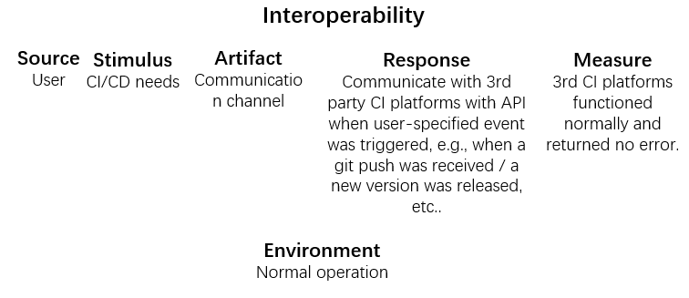
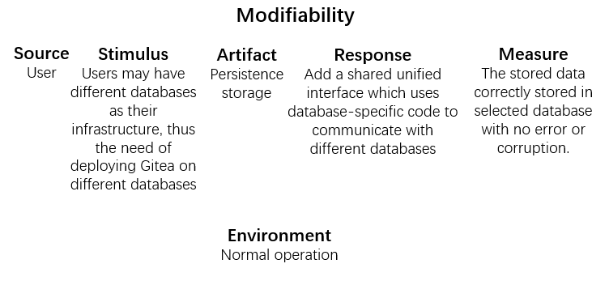
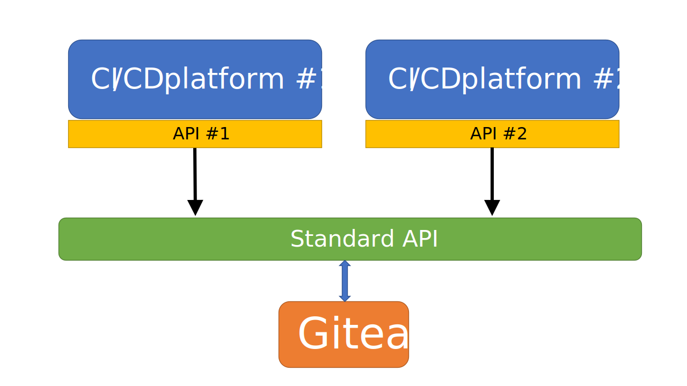
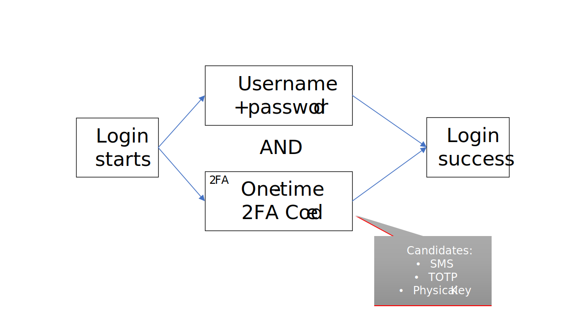
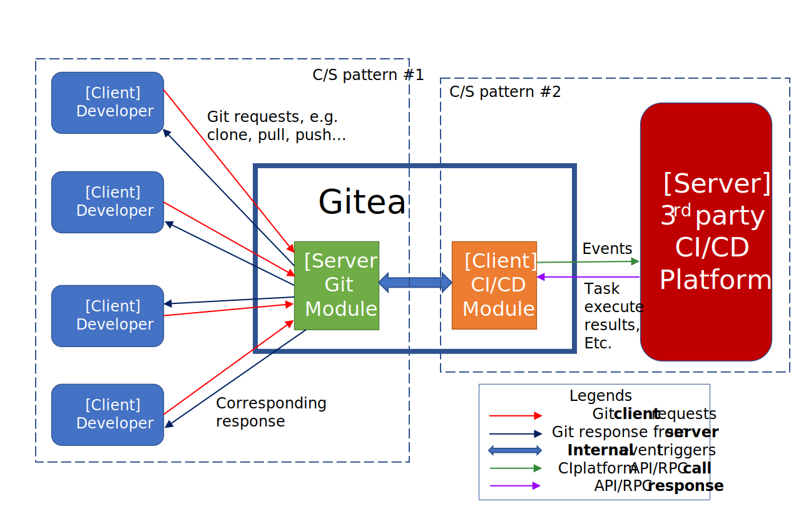

# What is Gitea?
* Gitea is a painless self-hosted Git service. It is similar to GitHub, Bitbucket, and GitLab. Gitea is a fork of Gogs. See the Gitea Announcement blog post to read about the justification for a fork.  
* The goal of this project is to provide the easiest, fastest, and most painless way of setting up a self-hosted Git service. With Go, this can be done platform-independently across all platforms which Go supports, including Linux, macOS, and Windows, on x86, amd64, ARM and PowerPC architectures. You can try it out using the online demo.

## Feature
* User Dashboard
    * Context switcher (organization or current user)
    * Activity timeline
        * Commits
        * Issues
        * Pull requests
        * Repository creation
    * Searchable repository list
    * List of organizations
    * A list of mirror repositories
* Issues dashboard
    * Context switcher (organization or current user)
    * Filter by
        * Open
        * Closed
        * Your repositories
        * Assigned issues
        * Your issues
        * Repository
    * Sort by
        * Oldest
        * Last updated
        * Number of comments
* Pull request dashboard
    * Same as issue dashboard
* Repository types
    * Mirror
    * Normal
    * Migrated
* Notifications (email and web)
    * Read
    * Unread
    * Pin
* Explore page
    * Users
    * Repos
    * Organizations
    * Search
* Custom templates
* Override public files (logo, css, etc)
* CSRF and XSS protection
* HTTPS support
* Set allowed upload sizes and types
* Logging
* Configuration
    * Databases
        * MySQL (>=5.7)
        * PostgreSQL (>=10)
        * SQLite3
        * MSSQL (>=2008R2 SP3)
        * TiDB (MySQL protocol)
    * Configuration file
        * app.ini
    * Admin panel
        * Statistics
        * Actions
            * Delete inactive accounts
            * Delete cached repository archives
            * Delete repositories records which are missing their files
            * Run garbage collection on repositories
            * Rewrite SSH keys
            * Resync hooks
            * Recreate repositories which are missing
        * Server status
        * User management
        * Organization management
        * Repository management
        * Authentication sources
        * Configuration viewer
        * System notices
        * Monitoring
    * Environment variables
    * Command line options
* Multi-language support (21 languages)
* Mermaid diagrams in Markdown
* Math syntax in Markdown
* Mail service
* Reverse proxy support
* Users
    * Profile
    * Settings
* Repositories
    * Clone with SSH/HTTP/HTTPS
    * Git LFS
* Watch, Star, Fork
* View watchers, stars, and forks
* Code
    * Issues
    * Pull requests
    * Commits
    * Releases
    * Wiki
    * Settings
* Package Registries
    * Composer
    * Conan
    * Container
    * Generic
    * Helm
    * Maven
    * NPM
    * Nuget
    * PyPI
    * RubyGems

## Context
Gitea is sponsored by INBlockchain, Equinix Metal, Two Sigma, SoEBeS, Allspice, Towhee, Hostea, and all of the backers on Open Collective.  
This project has been forked from Gogs since November of 2016, but a lot has changed.


## Quality Attributes

### Cross-platform

Gitea runs anywhere Go can compile for. It can run on multiple operating systems: Windows, macOS, Linux, etc. And also multiple CPU architectures: x86_64, i386, arm64, arm, risc-v, etc. Choose the one you love!

### Easy to install

As simple as run the binary for your platform. This also make other options easy, for example ship it with Docker, or get it packaged.

### Lightweight

Gitea has low minimal requirements and can run on an inexpensive Raspberry Pi. Save your machine energy!

### Open Source

Go get code.gitea.io/gitea! Join us by contributing to make this project even better. Don’t be shy to be a contributor!

### Interoperability

Gitea provides webhooks to notify an external system of any changes in repositories.
Also, it provides OAuth/OAuth2 to login, making it easy to integrate with 3rd-party authenticate systems.
Gitea is also designed to support multiple databases, including MySQL, PostgreSQL, SQLite3, MSSQL, and TiDB. Allowing user to choose from their favourites.

### Security

Gitea comes with CSRF and XSS protection and HTTPS support. This improves the security of the deployed instance.


## Key Drivers

* Low resource consuming
* Security

* Cross-platform supported

* Interoperability

* Modifiability

## Early Design Decision 

* Gitea shall consume a little resource. GitLab is a all-in-one solution including CI/CD, gists, etc.,
where Gitea aims to only do the code management, issues, etc., without bulit-in CI/CD (but it still retained the ability
to be integrated with 3rd-party CI/CD platforms, like Jenkins, via webhooks. This is a perfect balance of simplicity and ability).  
* Gitea shall support multiple platforms. With Go, this can be done platform-independently across **all platforms** which Go supports,
including Linux, macOS, and Windows, on x86, amd64, ARM and PowerPC architectures.  
* Gitea shall be easy to use. Gitea provides GUI via web interface, so that end users can use it easily without entering commands on the command line.  
  
* Gitea should be similar to existing Git hosting solutions hence users could migrate from other solutions painlessly.
Gitea should be able to migrate to another instance of server when required, by carefully designing its data structure and dependencies.

* Gitea should provide more security to its end user. To accomplish that, Gitea
integrated internal TLS support for its web interface, introduced password-less
SSH authentication, implemented and strictly comply to RFC 6238 (the TOTP
algorithm) in order to protect user from the threat of password-stealers.


## Key Stakeholders

### Programmer
Responsible for software development

#### Concerns
* It should provide easy and overall git service.  
* It should ensure security.

### Company
Funding for software development

#### Concerns
* It should consume a little resouce in order to reduce git server costs.

## Technical Context
* Secutiry  
Gitea comes with CSRF and XSS protection and HTTPS support. This improves the security of the deployed instance.

* Multiple OS support  
Written with Go, Gitea can be platform-independent, without any explicit design, across all platforms which Go supports,
including Linux, macOS, BSD-like OS's, Solaris, GNU Hurd, AIX, Windows, and even Android;
on i386, amd64, MIPS, RISC-V, S390(X), ARM, SPARC and PowerPC architectures.

* Support Git v2 protocol  
Gitea should support and follow git protocol because Gitea is a code version management tool based on git command.  
It also have to utilise and integrate with the `git` tool since it is the most popular way to interact with git repositories.  
Moreover, since `git` uses `openssh` and even more tools, gitea should track any update of these tools, in order to be  
compatible with any deploy environments.

* Parallel support
It is inevitable that occasionally Gitea should handle incoming requests at the same time, for example, when two committers pushed to the same repository simultaneously.


## Key Driver Scenario

* Low resource consuming

```
Scenario  

Source: User  
Stimulus: Git operation such as pull, push, etc.  
Environment: Normal operation  
Artifact: Processors  
Response: Occupy CPU and memory  
Response measure: Memory occupation should be less than 300Mb when Gitea is first run. 
```


* Security

```
Scenario

Source: User
Stimulus: Login
Environment: Normal operation
Artiface: Communication channels
Response: Log user in according to provided TOTP code
Response measure: Log user in if TOTP code is correct, otherwise it fails.
```


* Interoperability

```
Scenario

Source: User
Stimulus: CI/CD needs
Environment: Normal operation
Artiface: Communication channels
Response: Communicate with 3rd party CI platforms with API when user-specified event was triggered, e.g. when a git push was received / a new version was released, etc..
Response measure: 3rd CI platforms functioned normally and returned no error.
```


* Modifiability
```
Scenario

Source: User
Stimulus: Users may have different databases as their infrastructure, thus the need of deploying Gitea on different databases
Environment: Normal operation
Artiface: Persistence storage
Response: Add a shared unified interface which uses database-specific code to communicate with different databases.
Response measure: The stored data correctly stored in selected database with no error or corruption.
```


## Architecture Tactics

* Interoperability

Tailor Interface: Gitea provides no integrated CI/CD itself, but by implementing some de facto industry standard APIs, Gitea attains interoperability with 3rd party CI systems and/or custom applications.



* Modifiability

By using abstract common services, Gitea can utilise and interact with multiple types of database including MySQL, MSSQL, PostgreSQL, and SQLite3, whereas retaining a unified interface for other parts of code. The detailed implementation can be found [here](https://github.com/go-gitea/gitea/blob/main/models/db/engine.go).


* Security

Users, especially enterprise users, may have more security concerns. Thus an extra authentication method other than username and password. To address this problem, Gitea allows utilising one more method (to be concrete, TOTP-based one-time code) to authenticate user, providing added security.




## Architecture Patterns

#### Client‐Server Pattern

Client-Server pattern is applied twice in Gitea.

1. Client: git client installed on the developer's computer

   Server: Gitea deployed on the team server

   In a scenario of multi-person cooperative development, a Git server is needed for centralized code management. Developers  share their codes for team development. Clients send git requests such as clone, pull, push to server and the server responds accordingly. Communication between clients and the server is via HTTPS or SSH up to the users.

2. Client: Gitea deployed on the team server

   Server: 3rd party CI/CD platform

   When a software needs to be updated frequently, continuous integration, delivery and deployment are highly needed. After  configuration about the third-party platform is done on Gitea, the client, Gitea deployed on the team server, will send the CI/CD request to the third-party platform whenever the developer submits the code. After receiving the event, the server, the third-party platform completes CI/CD and returns the corresponding execution results to the client.




## Architecture Evaluation

### Utility Tree


### Architecture Approach

<table>
    <tr>
        <td>Scenario</td>
        <td colspan="4">Login</td>
    </tr>
    <tr>
        <td>Q-Attribute</td>
        <td colspan="4">Security</td>
    </tr>
    <tr>
        <td>Environment</td>
        <td colspan="4">Normal operation</td>
    </tr>
    <tr>
        <td>Stimulus</td>
        <td colspan="4">User wants to send git request but dose not login</td>
    </tr>
    <tr>
        <td>Response</td>
        <td colspan="4">Require user to login</td>
    </tr>
    <tr>
        <td>Architectural Decisions</td>
        <td>Sensitivity</td>
        <td>Tradeoff</td>
        <td>Risk</td>
        <td>Non-risk</td>
    </tr>
    <tr>
        <td>User name and password login</td>
        <td></td>
        <td></td>
        <td>R1</td>
        <td></td>
    </tr>
    <tr>
        <td>2FA</td>
        <td>S1</td>
        <td>TO1</td>
        <td></td>
        <td>NR1</td>
    </tr>
    <tr>
        <td>Reasoning</td>
        <td colspan="4">More reliable and secure authentication method</td>
    </tr>
    <tr>
        <td>Arch. model</td>
        <td colspan="4">username and password login with additional authentication</td>
    </tr>
</table>

**Notes:**

* R1: User name and password are at risk of disclosure.
* TO1: Security verse peformance. 2FA may reduce system performance and spend more time.
* S1: 2FA is sensitive to user's phone number if SMS verification code is chosen as authentication.
* NR1: 2FA is a reliable solution.

**Reasoning:**
* The 2FA key is less likely to be disclosed than the user name and password because it can be used only once and must be used within the validity period.

